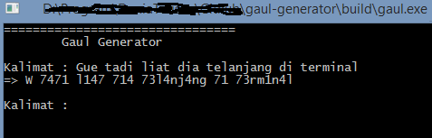

Program mengubah kalimat formal menjadi kalimat gaul.
Mengubah huruf a/A menjadi 4, i/I menjadi 1, g menjadi 9, G menjadi 6 dst...

# TODO
Pengecekan per kata (Selesai)

# BUILD
	gcc src/alay.c -o allay.exe
	allay

# Change Log
v0.1	Mengganti huruf dengan nomer yang sesuai
v0.2	Kerangka perubahan dari file
v0.3	Efisiensi pembacaan kalimat
v1.0	Perubahan kata
